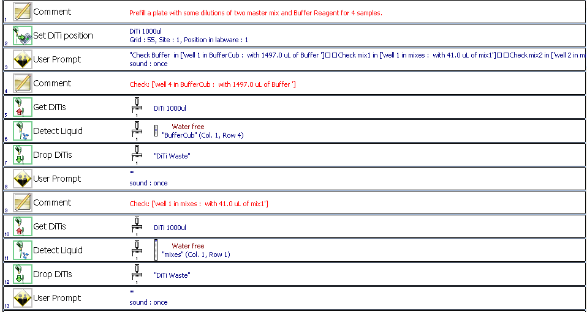
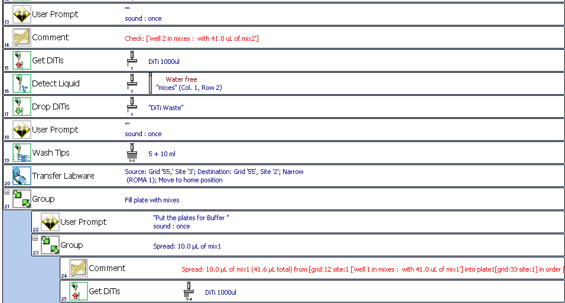
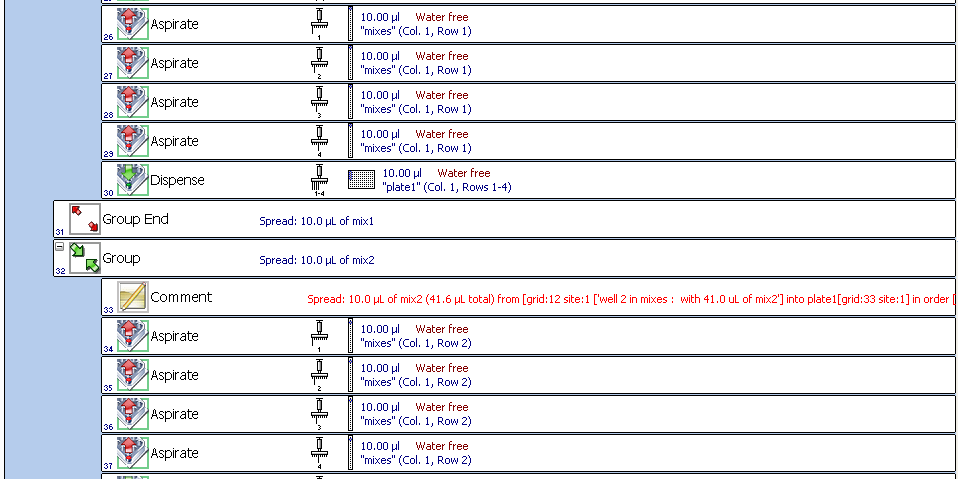
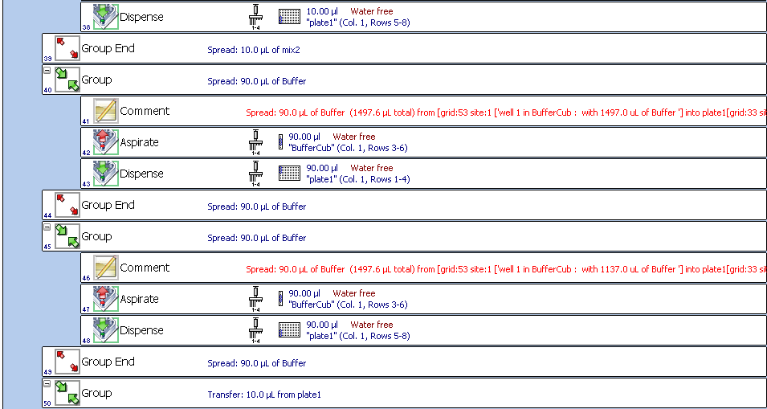
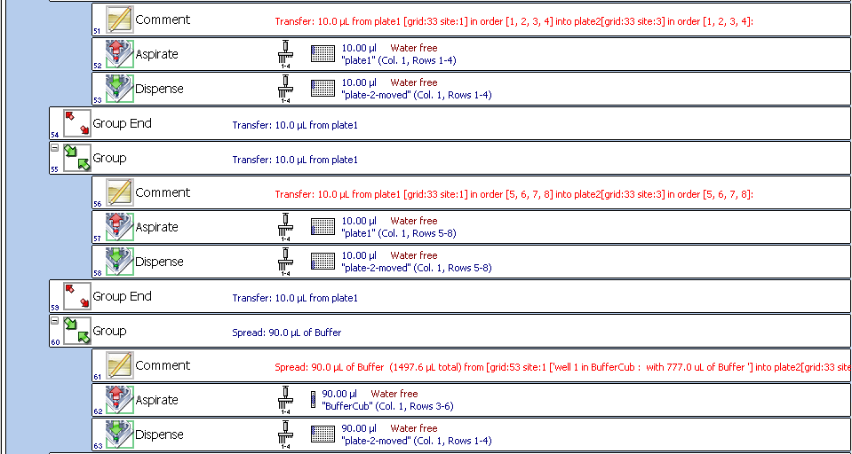
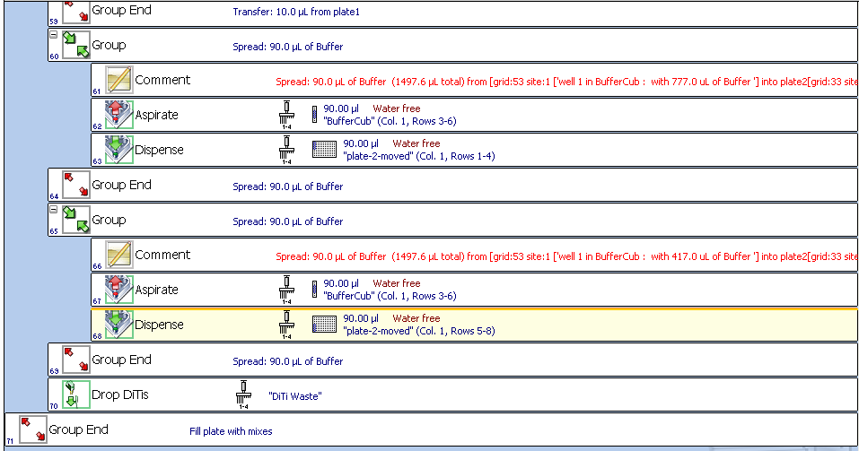

- How to run an existing protocol?
- How does it works?
- A Hello World! example.
- How to modify an existing protocol?
- Now to write a new protocol?

How to run an existing protocol?
^^^^^^^^^^^^^^^^^^^^^^^^^^^^^^^^

Make sure you have a working python3 interprete in your device (PC, tablet, smartphone, etc.) and a copy of RobotEvo (downloaded or cloned from GitHub).

Now, the simplest way is to run the python script containing the protocol, providing it have a "main" function.

For better control, in a your onw python script, import the desired protocol and just create an instance (python object) of the protocol, 
possibly setting some of the constructor parameters, and call the `.run()` method of that object.
You can see many examples of this usage in the script robotevo/protocols/test.py 
This will create a set of files with the generated evoware scripts, a human readable protocol, and comments, possibly including warnings. 
It may abort with more or less detailed messages about the errors.

Alternatively run `GUI.py` (only in devices with a functioning standard python module "tkinter") to select the protocol, 
the desired protocol "variant" and change some other minor parameters like number of samples or required reagents volume.

To make the actual pippeting in the real robot, open the generated `.esc` script in the EVOware editor. 
It will alert you that the check sum have not been set, which in this case just flags the fact that this is a newly generated script you have not run yet. 
Accept to load it in the EVOware script editor. Here you will have very good assistance to visualize 
the details of each step and to do a normal, full TECAN validation of the correctness of the script. 

Use the information from the visual worktable map to physically setup the labware. Use the detailed comments automatically
inserted by RobotEvo in the script or the associated `.protocol.txt` file to fill the expected initial volume of each reagent.

Use EVOware to run the script as usually.

## How does it works?
Already the creation of the protocol object will run some "boilerplate" code to setup things we need to run the useful part of our protocol. 

For example it will parse the provided worktable template file (a `.ewt` or just a compatible `.esc` evoware file) 
and will remember (in a sort of `map`) all the labware present in the worktable, including its unique name, type and location.

It will also initialize some other characteristics of the used robot (not present in the worktable file) like number of tips in the LiHa, etc. 

Additionally it will set the desired EvoMode: what kind of output we want to produce - normally an evoware script (his generated script will include again all the information for the worktable), 
but also a human readable protocol, etc.

By running `.run()` we "create" or "get", from the parsed worktable file, labwares, like multiplates,
tube racks, etc, and "create" the reagents defined there in the script, including location in the worktable, volume, etc. 
This make possible for the "internal iRobot" to model or track the content of each well, 
and to detect (and report) potential logical errors in the protocol.

If at this point the protocol include a call to `.cehcklist()` instructions will be generated to inform to the human robot-operator **at run time**, the positions and initial quantity of all reagents he need to make sure are in place. If a GUI is in use and was previosly created 
a new sub-GUI will be automatically generated to show all the details of the defined reagents 
making possible to change some properties without modifying programmatically the protocol. 

A typical protocol will use the high level instructions inherited from `protocol_steps`, 
like `transfer`, `distribute`, `with tips`, etc., to express the "physical" protocol. 
This instructions are in turn internally implemented using lower level instructions like `aspirate`, 
`get tips`. etc. 
Each of this low level intructions will interact with the selected EvoMode to generate the corresponding instructions 
in the EVOware script and to check errors and change the state of the internally modeled `iRobot`, 
including the liquid volume in each well and tip and many other details.

## A Hello World! example.
Let create the classical, in the the world of programming, Hello World! example. 
It will just shows that message in the screen of the PC controlling the robot and will wait for user confirmation producing a typical sound.

By running the script:
.. literalinclude:: ../protocols/demos/hello_world/hello_world.py

[IMPORTANT: replace the `worktable_template_filename` argument with a valid -for your very onw robot- worktable template (`.ewt`) or script (`.esc`).]

we will have some files (currently 4) generated with names following the pattern of the `output_filename` constructor argument: in particular '../current/tests/hello_world.esc' will contain a new evoware script you can load into the Freedom evoware editor. After you agree to use the script with an still unvalidated check-summe you will see it just contain an instruction for a simple user promt. By using evoware to run this script you will get:

How to modify an existing protocol?
^^^^^^^^^^^^^^^^^^^^^^^^^^^^^^^^^^^
How to write a new protocol?
^^^^^^^^^^^^^^^^^^^^^^^^^^^^
.. literalinclude:: ../protocols/demos/demo_two_mixes/demo_two_mixes.py

we will have:

